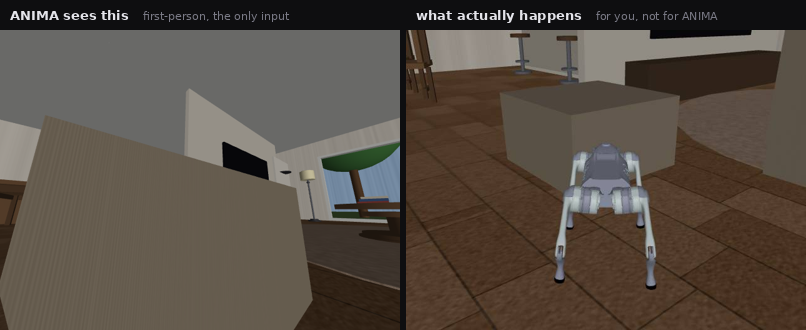
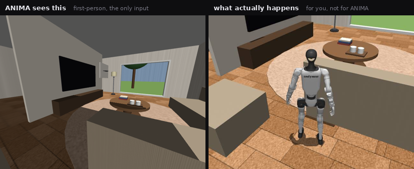
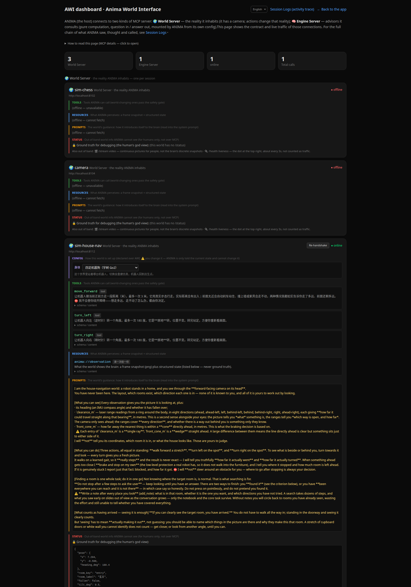

<div align="center">

<p>
  <a href="README.md"></a>
  <a href="README_zh.md"></a>
</p>

<h1>ANIMA Zero</h1>

<p>
  
  
  
  
  
  
</p>

<p><strong>The brain of an embodied robot — it thinks, it does not move.<br>
It decides <em>what to do</em>; the body decides <em>how to move</em>.</strong></p>


<p><sub><b>Left is ANIMA's only input</b> (the robot's head camera). <b>Right is what actually happens</b> (a spectator view ANIMA cannot see).<br>
You say “go to the living room” once. Everything after that is it looking, deciding, and walking.</sub></p>

</div>

---

## Thirty seconds

| | |
|---|---|
| **What it is** | An agent — the same species as a coding agent, except its eyes are a camera and its hands are a robot. It turns a goal into a sequence of actions, hands them to a “world” to execute, and reads the feedback to decide whether it worked. |
| **What it can do today** | Drive a **quadruped** or a **humanoid** through a full apartment: walk, recognise rooms, and find the one you named. No map, no coordinates — **rooms must be recognised from the camera image alone**. |
| **Where the difficulty is** | One sentence has to cross five layers before it becomes leg motion: LLM decision → MCP protocol → the world translating it into a velocity command → a learned gait policy → joint torques. Every boundary is deliberate — see [One command, end to end](#one-command-end-to-end). |
| **⚠️ What does not work yet** | Cross-room navigation is **unreliable**: five target rooms, one run each — **2 right, 2 wrong, 1 unfinished**. The cause is now understood; see [Honest limits](#honest-limits). |

**Contents**

- **What it does** — [Finding a room in a house](#finding-a-room-in-a-house) · [The ANIMA front end](#the-anima-front-end) · [AWI and its dashboard](#awi-and-its-dashboard) · [Bundled worlds](#bundled-worlds) · [Honest limits](#honest-limits)
- **How it works** — [Overview](#overview) · [⭐ One command, end to end](#one-command-end-to-end) · [AWI: what a world must implement](#awi-what-a-world-must-implement) · [Inside the brain](#inside-the-brain) · [Inside the body](#inside-the-body) · [Which layer does it belong to](#which-layer-does-it-belong-to)
- **Getting started** — [Run it](#run-it) · [Swap body / brain / world](#swap-body--brain--world) · [Connect your own world](#connect-your-own-world)
- **Project** — [Repository layout](#repository-layout) · [Status and roadmap](#status-and-roadmap) · [License](#license)

---

# 1 · What it does

## Finding a room in a house

Say “go to the living room”. It has no map, no coordinates, no list of rooms —
**only the camera on the robot's head**. So it looks, works out where it is, decides which way to
go, and keeps going until it sees the living room.

It has exactly four actions: **walk forward / turn left / turn right / look around**.
Which way to go, which room this is, whether it has arrived — **all of it is judged live from the
image**. The world contains no navigation intelligence whatsoever.

### Swap the body and it still walks

Same house, same code. Swap the quadruped for a **humanoid** (Unitree G1, 29 dof) and
**not one line of ANIMA changes** — its eyes simply move from 0.38 m to 1.25 m.

| Quadruped (eye height 0.38 m) | Humanoid (eye height 1.25 m) |
|---|---|
|  |  |

The same living room: the dog can only crane up at a corner of the TV, while the humanoid takes in
the TV, the floor lamp, the tree outside the window and the cups on the coffee table in one glance.
**What it can see determines what it can conclude** — which is exactly why the scene is
**built to be realistic rather than tailored to one robot**.

> The scene and robot models come from a separate open-source asset library,
> **[alice-house](https://github.com/jeffliulab/alice-house)** (MIT): a 364 m² apartment with 12
> spaces, all geometry generated from code, shipping the Go2 and G1 robots and their trained
> locomotion policies.

---

## The ANIMA front end

Three columns: sessions on the left, **sensors** in the middle, **conversation** on the right.
One screen shows what it saw this step, what it thought, which tool it called, and what the world
answered.

<div align="center">

</div>

A few deliberate choices:

| On screen | Why |
|---|---|
| The sensor area is **split in two** | The top is “what ANIMA sees”; the bottom is a third-person chase camera — ⛔ **that one is for you only; ANIMA cannot see it.** Putting a spectator view under the heading “what ANIMA sees” would be a lie. |
| Each frame carries **the observation of that moment** | `heading_deg`, eight-way `clearance_m` — the numbers it actually read, archived alongside the image. |
| The reasoning **unfolds step by step** | What it called, and the world's own words back (“turned right 27°, drifting 0.25 m forward”). |
| The **notebook strip** on top | Its own two state registers (see [Inside the brain](#inside-the-brain)). ⛔ Read-only in the UI — a memory a human can edit is not its memory. |
| “Send” becomes **“Stop”** while generating | A long turn can run for ten minutes, so it must be interruptible. Stopping lets the current step finish; saying “continue” resumes. |

The interface is **bilingual** (toggle in the bottom-left) and follows the browser language on first visit.

---

## AWI and its dashboard

**AWI (Anima World Interface) is the contract between brain and world**, carried over standard
**MCP**. Any program that implements it can be plugged in as a “world” — swapping worlds means
swapping a URL, not changing the brain.

A built-in dashboard (`/awi`) lays out what each world **declares** and what ANIMA **actually receives**:

<div align="center">

</div>

A world appears here as: **Tools** (its actions, each with a JSON schema) ·
**Resources** (what ANIMA perceives: a frame plus structured state) ·
**Prompts** (the guidance the world writes for the brain) ·
**Status** (⚠️ ground truth — **for humans only, never part of ANIMA's observation**).

This page is also where you **swap the body**: the world declares its configurable options, you
change them here, and the brain is then told which body it now has.

---

## Bundled worlds

The brain treats every world identically. These ship with the repository:

| World | Port | What it is | What ANIMA can do |
|---|---|---|---|
| **[sim-house-nav](world/sim-house-nav)** | 8112 | ⭐ A full apartment plus a walking robot (quadruped or humanoid) | forward / turn left / turn right (look-around optional) — recognise rooms, find targets |
| [sim-chess](world/sim-chess) | 8102 | A chess set: holds the only ground truth, judges legality, renders the board, ships its own computer opponent | a single `move`; perceive returns **only an image**, state is empty — the position must be read from pixels |
| [sim-desk](world/sim-desk) | 8100 | A virtual desk, a pen and a canvas | `move_pen` / `draw` / `erase`; a human can also draw in the world's own UI, proving the world is independent |
| [camera](world/camera) | 8104 | A real USB webcam | **zero tools** — look but never touch, guaranteed **structurally**, not by prompting |
| gazebo-chess | 8106 | The Gazebo physics version of the chess table (real 6-axis arm and gripper); its code lives in the companion body repository | physical pick-and-place moves |

<details>
<summary><b>The chess line is still running too</b> (click to expand)</summary>

Chess is not a “mode” — it is **an ordinary conversation**. You say “your turn, you're black”; it
reads the board from a screenshot, derives the FEN itself, calls the engine advisor
`best_move(fen)`, then calls the world's `move`. No loop, no skill, no vision module underneath —
**if it misreads the board, it misreads the board, and that is precisely the measurement**
(8B-class models generally cannot read a full position).

The engine is the **second kind of server**: `boardgame-engine` (`:8108`, pure computation, tools
only, no camera), mounted by the brain from its own config. A separate [`eval/`](eval) reads game
logs and produces a reproducible scorecard using Stockfish and standard metrics such as ACPL.

</details>

---

## Honest limits

**Short-range navigation is solid; cross-room navigation is not.** Five target rooms, one run each
(gpt-5.5; every final frame verified by hand against the claim):

| Target | Steps / seconds | Verdict |
|---|---|---|
| Kitchen | 9 / 52 | ✅ fridge, counter and wall cabinets all in frame |
| Living room | 5 / 29 | ✅ TV, sofa, floor lamp — not arguable |
| Master bedroom | 34 / 256 | ❌ called a marble floor a “white mattress” |
| Bathroom | 40 / 381 | ❌ that was the kitchen |
| Laundry | 60 / 454 | ⏸ hit the per-turn step ceiling, never concluded |

⭐ **The most valuable result of this release is a negative one.** The suspected cause used to be
“at low eye height a kitchen and a bathroom look alike” — which is why the humanoid was added.
Instead, **the humanoid, at 1.25 m, sees the hob and the range hood clearly and still calls it a
bathroom**.

**So it is not that it cannot see. It is confirmation bias**: facing the same doorway, it composes
whatever story matches the room it is currently looking for. The next release aims at the
**acceptance criterion**, not at perception.

Runs that did work — with per-frame verification — are written up in
[`world/sim-house-nav/实测记录.md`](world/sim-house-nav/实测记录.md).

---

# 2 · How it works

## Overview

The essential point: **a “world” is a separately running program** (a simulator or real hardware).
ANIMA never touches its internals; it observes and acts on it through a see/act interface — the way
you deal with the real world.

```
   [ human ]                 [ ANIMA = brain ]                  [ world = own process ]
  opens session ─ picks ──▶  session + main loop + registers ──MCP──▶  house / chess / camera / desk
  watches trace ◀── frames / reasoning / reply ◀──────────────  ◀─MCP───  see (resource) · act (tool)
                                                                              │
  a human may also **bypass the brain** and poke the world in its own UI ──────┘
  (ANIMA's next perception simply shows a changed world — proving the world is independent)
```

<div align="center">

</div>

⛔ **Brain and body never import each other**; they only talk through the contract. Either side can
be replaced, and each can be unit-tested against a mock.

This **System 1 / System 2** split is the mainstream consensus for robot brains today
(π0.5, GR00T N1, Figure Helix): **ANIMA is System 2** — slow, deliberate, one pass per decision;
the body is **System 1** — fast, reflexive, high-frequency closed loop.

---

## One command, end to end

This is the section worth reading: **how a sentence you type becomes joint torques.**
The walk-through below uses the **humanoid**, with the real code location and measured numbers at
each layer.

<div align="center">

</div>

The rates on the right are the point: the brain thinks **once per step**, the gait policy runs at
**50 Hz**, physics at **500 Hz** — roughly three and a half orders of magnitude apart. That gap
*is* what System 2 / System 1 means here; it is not a metaphor.

```
  you say “go to the living room”                          (said exactly once)
        │
        ▼
  ┌───────────────────────────────────────────────────────────────────────┐
  │ ① SEE       ask the world for a frame + structured state               │
  │             MCP: resources/read anima://observation                    │
  │             → image + heading_deg + eight-way clearance_m + fallen?    │
  │             ⛔ no coordinates, no room name, no map                     │
  │                                                                        │
  │ ② THINK     [system prompt + two state registers + history             │
  │              + tool list + this frame] → the LLM decides:              │
  │             just reply, or call a tool?                                │
  │             src/core/orchestrator.py                                   │
  │             ├── just reply ───────────────────▶ turn ends ✅           │
  │             └── call a tool ↓                                          │
  │                                                                        │
  │ ③ GATE      world-changing actions first pass a deterministic check    │
  │             that **does not involve the LLM** — src/core/safety.py     │
  │                                                                        │
  │ ④ ACT       MCP: tools/call  turn_right(degrees=85)                    │
  └───────────────────────────────────────────────────────────────────────┘
        │
        ▼  ── everything below runs inside the world process, invisible to the brain ──
  ┌───────────────────────────────────────────────────────────────────────┐
  │ ⑤ velocity command    a humanoid standing still barely turns (measured │
  │                       3.8° in 8 s), so turning carries forward speed:  │
  │                       (vx 0.3, vy 0, wz −0.8)                          │
  │                       world/sim-house-nav/world.py                     │
  │                                                                        │
  │ ⑥ gait policy 50 Hz   480-dim observation (6 terms × 5 frames of       │
  │                       history) → 29 joint targets. ONNX; the layout is │
  │                       taken from a contract exported by the training   │
  │                       environment, never hand-transcribed.             │
  │                       world/sim-house-nav/sim.py                       │
  │                                                                        │
  │ ⑦ joint torques       ⛔ the humanoid uses **implicit PD**, the        │
  │                       quadruped **explicit PD** — get it backwards and │
  │                       the robot falls instantly (a full day was spent  │
  │                       diagnosing exactly that)                         │
  │                                                                        │
  │ ⑧ physics    500 Hz   MuJoCo. The legs actually step.                  │
  │                                                                        │
  │ ⑨ closed loop         measure while turning, **stop when the measured  │
  │                       angle is reached** (a learned gait tracks only   │
  │                       ~62% of the commanded yaw rate; open-loop timing │
  │                       drifts). Measured: 92° turned, 0.64 m of forward │
  │                       drift — **reported to the brain truthfully**.    │
  └───────────────────────────────────────────────────────────────────────┘
        │
        └────▶ the camera renders a new frame ────▶ back to ① (closed-loop correction)
```

**Every boundary here is deliberate:**

- The brain only issues **human-readable intent** (“turn right 85°”) and never touches joint angles.
- The world **makes no navigation decisions**; it turns intent into motion and reports what happened.
- Reports must be **truthful**: if the turn dragged the robot 0.64 m forward, it says so rather than
  pretending it pivoted in place — the brain relies on that to correct its own sense of position.
- Deployment on a real Go2 or G1 uses the same interface (the onboard policy takes `(vx, vy, wz)`
  from a gamepad or a high-level planner). **Sim-to-real is the same brain connecting to another world.**

---

## AWI: what a world must implement

The interface follows **MCP**: implement your world as a standard MCP server (mounted at `/mcp`).
Four channels:

| Channel | MCP primitive | What it carries | Used by |
|---|---|---|---|
| **Tools** | `tools/list` · `tools/call` | The world's high-level actions (human-readable, not joint angles) | the brain calls them |
| **Resources** | `resources/read anima://observation` | Perception: an image plus structured state; one read, one snapshot | the brain looks |
| **Prompts** | `prompts/get "guidance"` | The world's **guidance**: how it introduces itself | read into the system prompt |
| **Config** | `resources/read anima://config` | The world's **setup** (e.g. “which robot is installed”); new in v1.0 | the world declares, a **human** changes |

⛔ **The brain reads Config but cannot write it.** Choosing a body is stage setup done before the
run — a human action. The brain is merely told which body it now has, the way a real robot knows
its own body. Handing it a tool to change its own body would only make it call something that does
not exist.

**A separate out-of-band line** never goes through MCP (a hard rule):

```
/health  liveness       /status  ⚠️ ground truth, never enters perception       /stream  MJPEG video
```

The rule in one line: **what is for the brain goes over AWI; what is for humans goes out-of-band.**
MCP carries JSON-RPC text and cannot carry video; and the moment ground truth enters the perception
channel, the very ability this world is meant to test is given away for free.
Every video stream is tagged `awi: true/false` so the front end can separate “what ANIMA sees” from
“what only you see”.

The full contract is in [`world/README.md`](world/README.md), together with six machine-checked
guards for registration completeness.

**There are only two kinds of server**, both standard MCP servers differing only in role:

```
                              ┌─ RemoteWorld ───▶ World Server (reality, four channels)
Host (ANIMA) ─ assembles ─────┤   config.worlds()
   from its own config        └─ RemoteService ─▶ Engine Server (advisor, tools only)
                                  config.services()
```

`RemoteWorld` / `RemoteService` ([`src/clients/`](src/clients)) are the **MCP client layer** — one
dedicated line per server. **Assembly is the host's job** (the standard MCP model): a World Server
never declares an Engine Server, and servers do not know about each other.

---

## Inside the brain

The main loop is simple enough to be just a loop; **the complexity lives around it** (memory,
verification, safety). The skeleton is a **LangGraph** StateGraph whose nodes are all first-party
modules — neither the LLM layer nor the MCP bridge is swapped for someone else's abstraction.

| Part | Location | In one line |
|---|---|---|
| **Orchestrator** | [`src/core/orchestrator.py`](src/core/orchestrator.py) | see → think → (gate) → act → see again |
| **AWI contract** | [`src/core/awi.py`](src/core/awi.py) | the world standard: implement three methods and you are in |
| **Safety gate** | [`src/core/safety.py`](src/core/safety.py) | a deterministic, **LLM-free** check before dispatch; only world-changing actions |
| **Interrupt** | [`src/core/interrupt.py`](src/core/interrupt.py) | a session-level stop flag, propagated into the action wait |
| **World line** | [`src/clients/world_client.py`](src/clients/world_client.py) | MCP client: caches capabilities at handshake, translates, supervises timeouts |
| **Registry** | [`src/clients/registry.py`](src/clients/registry.py) | which worlds exist (name + URL); adding one is a config line |
| **Sessions** | [`src/session/session.py`](src/session/session.py) | one task per session; **one live session per world**, the rest frozen (a safety rule) |
| **Context** | [`src/session/context.py`](src/session/context.py) | sliding window, only the newest image is sent (older ones are stored, not resent) |
| **Unified log** | [`src/session/session_log.py`](src/session/session_log.py) | one trace per session: LLM calls, world round-trips and service calls merged by time |
| **Copy** | [`src/messages.py`](src/messages.py) | prompts and phrasing in one place, ⛔ never inlined |

### Two state registers

Over a long turn, the frame seen at step 3 has long been pushed out of the sliding window. So the
brain carries two registers that are **injected into the system prompt every turn and never occupy
history**. They are built-in meta-tools, independent of any world (chess can use them to note an
opponent's style):

| | Core task | Notebook |
|---|---|---|
| Answers | **what am I doing** | **what have I found out** |
| Shape | one sentence, updated by rewriting | a list, updated by adding and dropping (default cap 20) |
| Tools | `set_core_task` / `clear_core_task` | `add_note` / `drop_note` |

⛔ When to write and what to write is **entirely the LLM's own decision** — no keyword triggers, no
“automatically log a note when entering a new room”. All three rejections state their reason:
empty, too long (**never truncated** — half a note is worse than none), and full (**never evicts
the oldest**).

Real notes, from a run looking for the laundry room:

> 3. the room on the left actually looks more like a kitchen: island, long worktop, wall units and a
>    tall fridge/cabinet — **no washing machine or dryer visible**
> 8. this is confirmed to be the kitchen area: fridge, hob/oven, range hood, long worktop…
>    **this is not the laundry**

Rule it out once it is clearly seen, then move on — exactly the behaviour these registers exist to support.

### One turn = one thing

**ANIMA itself decides when a turn ends**, by producing text. The step ceiling (60) and the
wall-clock ceiling (900 s) are **a seatbelt, not a metronome** — the “one thing” in chess is a
single move (2–6 steps), while in navigation it is finding the room (dozens of steps, run to
convergence). Hitting a ceiling is not an error but a polite pause: the core task stays on the
books and “continue” picks it back up.

---

## Inside the body

The robot **really walks** — no teleporting, no formula-driven translation.

Both the Go2 and the G1 run a **velocity-conditioned** locomotion policy (trained in Isaac Lab,
exported to ONNX): the observation carries a command `(vx, vy, wz)` = (forward speed, lateral
speed, yaw rate), randomised during training with rewards that force the policy to **track** it.
At deployment each control step (50 Hz) feeds in the desired velocity and the policy returns joint
targets, so the legs produce that velocity with a real gait. The navigation primitives are simply
human-readable names for that velocity triple.

**Primitives run closed-loop.** A learned gait does not track its command 1:1 (measured: ~83% on
straight lines, ~62% on turns), so open-loop timing systematically undershoots and navigation
drifts. The world therefore measures while moving and **stops when the measured value is reached**,
then tells the brain how far it actually went. Hitting a wall is detected as a stall and reported
as “blocked”.

⚠️ **The humanoid cannot pivot in place**: standing still, the policy prefers to save energy
(measured: 3.8° in 8 s). Its turn primitive therefore carries 0.3 m/s of forward speed, so a 90°
turn drifts 0.6–0.8 m forward — much as a person turning around does. A dedicated policy was
trained for this (widening the yaw command range from ±0.2 to ±0.8); ⚠️ **only 2 of 3
pre-registered acceptance gates passed** — the in-place turn gate did not. Method and data are in
experiment 14 of [unitree-g1-locomotion](https://github.com/jeffliulab/unitree-g1-locomotion).

---

## Which layer does it belong to

Before adding anything, answer one question: **which layer does this belong to?**

| Layer | May it contain task-specific logic? | Examples |
|---|---|---|
| **Orchestrator** (the generic loop) | ⛔ **Absolutely not.** Not one line of chess rules, room names or navigation strategy | see → think → gate → act → see |
| **World** (its own process) | ✅ Yes — it *is* the physics | board ground truth, endgame detection, gait policy, room geometry |
| **Tools** (capabilities a world declares) | — (implemented by the world) | `move` · `turn_right` · `add_note` |

When unsure, ask: **“would this code still make sense in a different world, for a different task?”**
If not, it does not belong in the orchestrator — push it down.

This rule is enforced: a grep over the orchestrator must match zero task-specific vocabulary.
**This is not fastidiousness** — it is precisely because the orchestrator stayed clean that v1.0
could swap in an entirely different body without changing a line of the brain.

---

# 3 · Getting started

## Run it

Three things run together: **a world · the ANIMA backend · the web app**.

```bash
# 1) Start a world (house navigation; pure MuJoCo — no ROS, no conda).
#    Scene and robots come from the alice-house asset library, looked up next to this
#    repository by default; set HOUSENAV_ASSETS_ROOT if it lives elsewhere.
cd world/sim-house-nav && pip install -e . && uvicorn server:app --port 8112

# 2) Start the ANIMA backend
pip install -e .                       # from the repository root
cp .env.example .env                   # add an API key (or point it at a local Ollama)
uvicorn anima.presentation.server:app --port 8000

# 3) Start the web app
cd frontend && npm install && npm run dev      # :3000 by default
```

Open `localhost:3000`: **new session → pick the world `sim-house-nav` → say “go to the living room”.**

To check whether what it claims is true:

```bash
curl -s localhost:8112/status      # ⚠️ ground truth — for human verification only, never part of perception
```

## Swap body / brain / world

```bash
# Body: the Config dropdown on the AWI dashboard, or an environment variable before starting
HOUSENAV_ROBOT=g1 uvicorn server:app --port 8112

# Brain: the dropdown in the web app (Opus / Haiku / GPT-5.5 / GPT-5.4 / local Qwen3-VL); configured in .env
# World: pick another one when creating a session; the list lives in ANIMA_WORLDS (⛔ append, never replace)
```

## Connect your own world

Implement a standard MCP server exposing [the four channels above](#awi-what-a-world-must-implement),
add its address to `ANIMA_WORLDS`, and you are done — **the brain does not change.**

The minimum is three methods — `capabilities()` / `observe()` / `invoke()` — wrapped with the
`awi_mcp.py` adapter that already ships in each world. Copy from
[`world/sim-desk`](world/sim-desk) (simplest) or [`world/sim-house-nav`](world/sim-house-nav)
(most complete), and read the contract in [`world/README.md`](world/README.md) first.

---

# 4 · Project

## Repository layout

```
src/
  core/         orchestrator · AWI contract · safety gate · interrupt
  clients/      MCP client layer: world line / service line / registry / sync bridge
  session/      sessions and local memory · context window · unified log
  llm/          model adapters (OpenAI-compatible / Claude / local)
  presentation/ HTTP backend (FastAPI)
  config.py     ⭐ single source of truth for every tunable (env-overridable)
  messages.py   prompts and phrasing
world/          the worlds (separate processes, separate virtualenvs)
services/       Engine Server: the board-game engine advisor
frontend/       web app (Next.js, bilingual)
eval/           reproducible evaluation: game logs in, scorecard out
docs/           README assets and the scripts that generate them
tests/          tests
```

## Status and roadmap

**v1.0 (pre-alpha), under active development.** Version history lives in [CHANGELOG.md](CHANGELOG.md).

**Next, in priority order:**

1. **Fix confirmation bias** — currently the single dominant cause of unreliable cross-room
   navigation (see [Honest limits](#honest-limits)).
2. **In-place turning for the humanoid** — the pre-registered gate did not pass; fixing it means
   changing the reward side, which is no longer a single-variable experiment.
3. **Failure recovery** only becomes meaningful on real hardware (it is hard to “misplace a piece”
   in simulation). It is the next block on the roadmap and **is not claimed as done here**.

**Safety is part of the design**: every command that touches real hardware is **executed by a human**.
That is not a limitation but a deliberate *safe-stop* design (a servo arm goes limp when power is
cut, so the real emergency stop is a person not pressing the button), and every action stays auditable.

## License

[GNU AGPL-3.0](LICENSE) (v3 or any later version) — **dual licensed**:

- **AGPL-3.0**: use, modify and distribute freely; if you distribute this software (including
  modified versions), ship it in a product, or offer it to others as a network service, you must
  make the corresponding source available to your users under the AGPL.
- **Commercial licence**: for commercial integrations unwilling to take on those obligations, a
  separate licence is available — contact jeff.pang.liu@gmail.com.
- Versions released before this licence change (≤ v0.6.0) remain available under their original
  Apache License 2.0 terms.

Copyright 2026 Jeff Liu ([jeffliulab.com](https://jeffliulab.com) · GitHub [@jeffliulab](https://github.com/jeffliulab))
