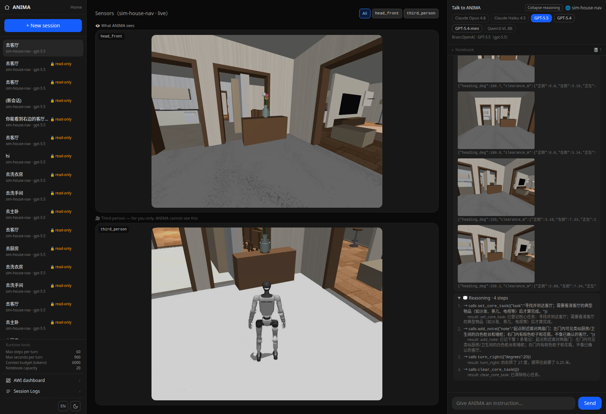

<div align="center">

<a href="README.md"></a>
<a href="README_zh.md"></a>

</div>

# ANIMA Zero

[](https://www.python.org)
[](https://modelcontextprotocol.io)
[](https://mujoco.org)
[](CHANGELOG.md)
[](LICENSE)

## 这是什么

ANIMA Zero 是一台具身机器人的脑。它只想、不动手：它决定做什么，身体决定怎么动。

跟它说一句「去客厅」。它没有地图、没有坐标、也没有房间清单，只有机器人头上那只相机。
它得从画面里自己判断身在何处、挑一个方向，一路走到看见你要的那间屋为止。
机器人是靠学出来的步态真的迈腿走的，没有任何瞬移。

<div align="center">

<br>
<sub>左边是 ANIMA 唯一拿得到的输入，右边是实际发生的事，而它看不到右边。</sub>
</div>

### 为什么叫「Zero」

它是系列名，不是版本号。**Zero 的含义是这条线永远开源**——脑叫 ANIMA Zero，身体叫 SOMA Zero；
将来若有商业版，会另起名字，而不是把这条线关掉。整个项目是 MIT。

装是 `pip install anima-zero`，导入是 `import anima`——光是 `anima` 那个名字在 PyPI 上已被别人注册。

## 核心能力

- **一个大脑，换得了身体**：同一份大脑代码驱动宇树 Go2 四足和宇树 G1 人形，一行不改，
  差别只在眼睛的高度，0.38 米对 1.25 米。
- **一个接口接任意世界**：世界是一个独立进程，用 AWI 走 MCP 说话。换世界只是换个地址。
- **从一句话到关节力矩**：一条指令要穿过五层才变成腿的动作，这几层的工作频率差三个半数量级。
- **长任务不忘事**：两个状态寄存器随系统提示常驻，六十步的一轮里既不会丢掉目标，
  也不会忘了已经排除过什么。
- **看得见、叫得停**：每一步的画面、思考和工具调用都留痕，跑到一半也能中断。

<div align="center">


<br>
<sub>同一间客厅，左边是四足看到的，右边是人形看到的。
机器人能看见什么，决定了它能想出什么，所以场景是按真实做的，不为某一台机器定制。</sub>
</div>

## 架构

世界是一个独立运行的程序，现在是仿真器，以后是真机。ANIMA 从不伸手进去。
大脑知道的一切都从四条通道进来，做的一切也从这四条出去。人还可以完全绕过大脑，
直接在世界自己的界面里拨弄它，这是两者确实分离的最好证明。

<div align="center">

</div>

底下那三个端点，真值、视频和探活，从不走 MCP，也从不进大脑。这条分离是刻意的：
真值一旦进了感知通道，这个世界本来要考的能力就白送了。

放到一条具体的指令上，分层就变得实在了。大脑每步想一次，步态策略跑 50 赫兹，物理跑 500 赫兹。
这道鸿沟就是 System 2 与 System 1 在这里的真实含义，也是大脑只能下达意图、
永远不碰关节角的原因。

<div align="center">

</div>

世界的汇报是如实的，不是好听的。人形没法原地转身，所以它的转弯要带一点前进速度，
转完人就往前挪了 0.64 米；世界会照实说，大脑据此修正自己对位置的估计。

```text
src/core/      编排器、AWI 契约、信任存储、安全闸
src/clients/   MCP 客户端层与世界注册表
src/session/   会话、上下文窗口、统一日志
src/llm/       各家大模型适配     src/presentation/  HTTP 后端
world/         各个世界，每个是独立进程
services/      棋类引擎顾问       frontend/  网页    eval/  记分卡
```

## 安装

```bash
uv tool install anima-zero     # 或者 pipx install，或者普通 pip
anima demo
```

它会起一个世界、接上一个大脑，然后让你直接跟它对话。**不需要 API key，不需要 node，不用再装别的。**
它用的那个大脑不思考——只调一个工具、把结果报回来——因为 demo 的意义是让你看见那个循环，不是让你惊艳。
配好 key 之后 `anima demo --brain gpt-5.4`，同一个循环换一个真会想的大脑。

```text
anima demo                    一条命令，看它跑起来
anima chat --world W          在终端里对话
anima run --say "..."         跑一轮就退出，可脚本化
anima serve                   起后端 API（网页连它）
anima world add 名字 地址      登记一个世界——先看清它声明了什么，再决定批不批
anima doctor                  什么配好了、什么连得上
```

### 完整搭一套

三个进程：一个世界、后端、网页。

```bash
# 1. 起一个世界 —— 住宅导航，纯 MuJoCo，不需要 ROS 也不需要 conda。
#    场景和机器人来自 alice-house，默认在本仓库同级目录找；
#    放在别处就设 HOUSENAV_ASSETS_ROOT。
cd world/sim-house-nav && pip install -e . && uvicorn server:app --port 8112

# 2. 起后端
pip install -e .
cp .env.example .env          # 填一个 API key，或者指向本地 Ollama
anima serve                   # 或者：uvicorn anima.presentation.server:app --port 8000

# 3. 起网页
cd frontend && npm install && npm run dev
```

### 接一个世界，是一次信任决定

世界是通过 URL 连上的独立进程，而**它对自己的说明会进入大脑的系统提示词**。所以在你亲眼看过并点头之前，
一个世界的工具和说明书不会到达大脑：

```bash
anima world add myworld http://localhost:9000   # 先把它声明的东西摊开给你看，再问你批不批
```

审批绑定在**内容**上、不绑名字：世界回来时长得不一样了，会带着"变了什么"重新问你一遍。
自己开发世界时每改一次都会触发，那时设 `ANIMA_TRUST_ALL=1`。
这道防线**保护什么、不保护什么**，见 [SECURITY.md](SECURITY.md)。

## 跑一遍 demo

打开 `localhost:3000`，新建一个连 `sim-house-nav` 的会话，输入「去客厅」。
中间那栏上面是机器人看到的画面，下面是只有你看得到的第三视角跟拍。
右边那栏是每一步的全过程：看到的画面、思考、调了什么工具、世界回了什么。

<div align="center">

</div>

想核实它说的是真的还是听着像真的，直接问世界。这个端点只给人验收，从不进感知：

```bash
curl -s localhost:8112/status
```

换东西各是一行的事。换身体在 AWI 仪表盘上有个下拉，也可以起服务前设 `HOUSENAV_ROBOT=g1`。
换大脑在网页上有下拉。换世界在新建会话时选，清单在 `ANIMA_WORLDS` 里。

仓库自带这几个世界：

| 世界 | 端口 | 是什么 |
|---|---|---|
| [sim-house-nav](world/sim-house-nav) | 8112 | 一套住宅加一台会走路的机器人，四足或人形 |
| [sim-chess](world/sim-chess) | 8102 | 一副棋具，握着唯一真值，还能跟你对弈 |
| [sim-desk](world/sim-desk) | 8100 | 一张桌子、一支笔、一块画布 |
| [camera](world/camera) | 8104 | 真实摄像头，一个工具都没有，只能看不能动 |

### 它到底做得怎么样

五个目标房间各跑一次，每一次的最后画面都逐张核对过它到底说了什么：

| 目标 | 步数 | 结果 |
|---|---|---|
| 厨房 | 9 | 对，冰箱、台面和吊柜都在画面里 |
| 客厅 | 5 | 对，电视、沙发、落地灯，没什么可争的 |
| 主卧 | 34 | 错，把大理石地板说成了「白色床垫」 |
| 洗手间 | 40 | 错，那是厨房 |
| 洗衣房 | 60 | 没收尾，撞上了单轮步数上限 |

真正有价值的是那个否定的结果。原先怀疑的病因是「0.38 米的高度上厨房和卫生间长得像」，
接人形也有这个考虑。可人形在 1.25 米能清楚看见灶台和抽油烟机，照样说这是洗手间。
所以这不是感知问题：面对同一扇门，它会编出符合当前所找目标的说辞。
下一版要动的是判据，不是感知细节。

走通的那些案例，含逐张画面核对，写在
[world/sim-house-nav/实测记录.md](world/sim-house-nav/实测记录.md)。

## 接你自己的世界

实现一个标准 MCP server，提供上面那四条通道，把地址加进 `ANIMA_WORLDS`，大脑一行不改就能驱动它。
最小的一份只有三个方法，`capabilities()`、`observe()`、`invoke()`，用每个世界都自带的 `awi_mcp.py`
适配层包一下即可。照 [sim-desk](world/sim-desk) 抄最简单的，照 [sim-house-nav](world/sim-house-nav)
抄最完整的，动手前先读 [world/README_zh.md](world/README_zh.md)。契约写在
[docs/awi-spec-v1_zh.md](docs/awi-spec-v1_zh.md)，`anima conformance <地址>` 照它核一个世界。

## 致谢

场景、机器人模型和运动策略来自 [alice-house](https://github.com/jeffliulab/alice-house)。
人形的转弯策略在 [unitree-g1-locomotion](https://github.com/jeffliulab/unitree-g1-locomotion) 里训练。
物理引擎是 [MuJoCo](https://mujoco.org)，机器人模型源自 [MuJoCo Menagerie](https://github.com/google-deepmind/mujoco_menagerie)。
