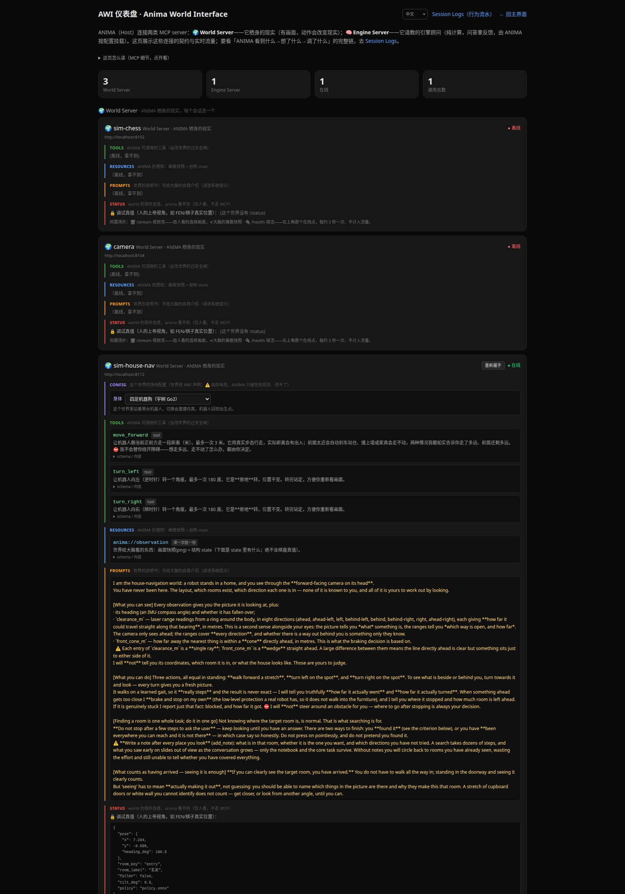

<div align="center">

<p>
  <a href="README.md"></a>
  <a href="README_zh.md"></a>
</p>

<h1>ANIMA Zero</h1>

<p>
  
  
  
  
  
  
</p>

<p><strong>一台具身机器人的「脑」——它只想、不动手。<br>
它决定「做什么」，身体决定「怎么动」。</strong></p>


<p><sub><b>左边是 ANIMA 唯一的输入</b>（机器人头部相机）<b>，右边是实际发生的事</b>（旁观视角，ANIMA 看不到）。<br>
你只说一句「去客厅」，剩下的是它自己看、自己判断、自己走。</sub></p>

</div>

---

## 三十秒看懂

| | |
|---|---|
| **它是什么** | 一个 agent——和编码 agent 同一类东西，只是「眼」换成相机、「手」换成机器人。它把一个目标变成一串动作交给「世界」执行，再看反馈判断成没成。 |
| **它现在能做什么** | 指挥**四足机器狗**或**人形机器人**在一整套住宅里走路、认房间、找到你说的那间屋。不给地图、不给坐标——房间**必须靠看画面认出来**。 |
| **技术上难在哪** | 一句话要穿过五层才变成腿的动作：LLM 决策 → MCP 协议 → 世界翻成速度指令 → 学出来的步态策略 → 关节力矩。每层的边界都是设计出来的，见[一条指令的完整旅程](#一条指令的完整旅程)。 |
| **⚠️ 还不行的地方** | 跨房间导航**不可靠**：五个目标房间各跑一次，**2 对 2 错 1 没收尾**。病因已查明，见[诚实的边界](#诚实的边界)。 |

**目录**

- **它能做什么** — [在住宅里找房间](#在住宅里找房间) · [ANIMA 交互前端](#anima-交互前端) · [AWI 系统与前端](#awi-系统与前端) · [预设世界一览](#预设世界一览) · [诚实的边界](#诚实的边界)
- **它是怎么工作的** — [总览](#总览) · [⭐ 一条指令的完整旅程](#一条指令的完整旅程) · [AWI：接一个世界要实现什么](#awi接一个世界要实现什么) · [大脑这边](#大脑这边) · [身体那边](#身体那边) · [分层判据](#分层判据)
- **上手** — [跑起来](#跑起来) · [换身体 / 换大脑 / 换世界](#换身体--换大脑--换世界) · [接你自己的世界](#接你自己的世界)
- **项目** — [仓库结构](#仓库结构) · [状态与路线图](#状态与路线图) · [License](#license)

---

# 一、它能做什么

## 在住宅里找房间

跟它说一句「去客厅」。它没有地图、没有坐标、没有房间清单——**只有机器人头上那只相机**。
于是它自己看、自己判断这是哪儿、自己决定往哪走，一路走到看见客厅为止。

它能做的动作只有四个：**往前走一段 / 左转 / 右转 / 环视一圈**。往哪走、这是哪间屋、到没到，
**全部由它看着画面现场判断**——世界这边不含任何导航智能。

### 换一副身体，它照样走

同一套房子、同一份代码，把身体从四足机器狗换成**人形**（宇树 G1，29 自由度）——
**ANIMA 侧一行不改**，只是它的眼睛从 0.38 米升到了 1.25 米。

| 四足机器狗（眼高 0.38 m） | 人形（眼高 1.25 m） |
|---|---|
|  |  |

同一间客厅：狗只能仰头看见电视的一角，人形能一眼看到电视、落地灯、窗外的树和茶几上的杯子。
**看得见什么，决定了它能想出什么**——这也是场景要**按真实做、不为某一种机器人定制**的理由。

> 场景与机器人模型来自独立的开源资产库 **[alice-house](https://github.com/jeffliulab/alice-house)**（MIT）：
> 一套 12 空间 364 ㎡ 的大平层，几何全部由代码生成，配 Go2 与 G1 两台机器人和训练好的运动策略。

---

## ANIMA 交互前端

三栏：左边是会话，中间是**传感区**，右边是**对话**。一屏之内能看到它这一步看到了什么、
想了什么、调了什么工具、世界回了什么。

<div align="center">

</div>

几处值得说的设计：

| 界面上的东西 | 为什么这么做 |
|---|---|
| 传感区**分成两块** | 上面是「ANIMA 看到的画面」，下面是第三视角跟拍——⛔ **后者只给你看，ANIMA 看不到**。把旁观画面摆在「ANIMA 看到的」标题下就是撒谎。 |
| 每张画面下挂着**当时的观测** | `heading_deg`、八向 `clearance_m`——它当时读到的数字，一并留档，方便事后追。 |
| **思考过程逐步展开** | 每一步调了什么、世界回了什么原话（「向右转了 27 度，顺带往前挪了 0.25 米」）。 |
| 顶上的**笔记本条** | 它自己记的两个状态寄存器（见[大脑这边](#大脑这边)）。⛔ 网页只读——能被人改的记忆就不是它自己的记忆。 |
| 生成期间「发送」变**「停止」** | 长回合可能跑十几分钟，得能叫停；点了之后当前这一步做完就收尾，说「继续」能接上。 |

界面**中英双语**（左下角切换），首次访问跟随浏览器语言。

---

## AWI 系统与前端

**AWI（Anima World Interface）= 脑和世界之间的接口标准**，走标准 **MCP**。
任何程序只要实现它，就能作为一个「世界」被 ANIMA 接入——换世界只换地址，大脑一行不改。

内置一个仪表盘（`/awi`），把每个世界**声明了什么**、ANIMA **实际拿到什么**全摊开：

<div align="center">

</div>

一个世界在这里长这样：**Tools**（它有哪些动作，含每个动作的 JSON schema）·
**Resources**（ANIMA 的感知：画面 + 结构 state）· **Prompts**（世界写给大脑的说明书）·
**Status**（⚠️ 上帝视角真值，**只给人看，绝不进 ANIMA 的观测**）。

这一页也是**换身体**的地方——世界声明它有哪些配置项，你在这儿切，大脑随后被告知「你现在是什么身体」。

---

## 预设世界一览

大脑对所有世界一视同仁；下面这些是仓里自带的：

| 世界 | 端口 | 是什么 | ANIMA 能做什么 |
|---|---|---|---|
| **[sim-house-nav](world/sim-house-nav)** | 8112 | ⭐ 一套大平层住宅 + 一台会走路的机器人（四足 / 人形可切换） | 前进 / 左转 / 右转（环视可开）——认房间、找目标 |
| [sim-chess](world/sim-chess) | 8102 | 一副棋具：握唯一真值、判合法、渲染棋盘、自带电脑棋手 | 只有一个 `move`；perceive **只给画面**，state 空——局面得自己从画面读 |
| [sim-desk](world/sim-desk) | 8100 | 一张虚拟桌面 + 一支笔 + 一块画布 | `move_pen` / `draw` / `erase`；人也能在世界自己的界面上涂改，验证「世界是独立的」 |
| [camera](world/camera) | 8104 | 真实 USB 摄像头 | **零工具**——只能看、不能操作，这是**结构上**保证的，不靠提示词 |
| gazebo-chess | 8106 | 棋桌的 Gazebo 物理版（真六轴臂 + 真夹爪），代码住在配套的身体仓 | 物理抓放走子 |

<details>
<summary><b>下棋这条线也一直在跑</b>（点开看）</summary>

下棋不是一个「模式」——**就是普通对话**。你说「该你了，你执黑」，它自己看棋盘截图认局面、
自己从画面推出 FEN、自己调引擎顾问 `best_move(fen)` 拿着法、再调世界的 `move` 落子。
没有循环、没有技能、没有视觉模块兜底——**读错棋盘就读错，这本身就是对模型能力的测量**
（8B 级小模型基本认不对整盘）。

引擎是**第二类 server**：`boardgame-engine`（`:8108`，纯计算顾问，只有 Tools、没有画面），
由大脑按自己的配置挂载。独立的 [`eval/`](eval) 读对局日志、用 Stockfish 按 ACPL 等标准出一张
可复现的记分卡。

</details>

---

## 诚实的边界

**短距离导航稳，跨房间导航还不行。** 五个目标房间各跑一次（gpt-5.5，每一步的画面都逐张核对过）：

| 目标 | 步 / 秒 | 判定 |
|---|---|---|
| 去厨房 | 9 / 52 | ✅ 冰箱、台面、吊柜都在画面里 |
| 去客厅 | 5 / 29 | ✅ 电视、沙发、落地灯，无可争议 |
| 去主卧 | 34 / 256 | ❌ 把大理石地板说成了「白色床垫」 |
| 去洗手间 | 40 / 381 | ❌ 那是厨房 |
| 去洗衣房 | 60 / 454 | ⏸ 撞上单轮步数上限，没收尾 |

⭐ **这一版最有价值的结果是一个否定。** 原先以为病因是「低视角下厨房和卫生间长得像」，
所以才接了人形——结果**人形在 1.25 米能清楚看见灶台和抽油烟机，照样说这是洗手间**。

**所以不是看不见，是确认偏误**：它会对着同一扇门，编出符合当前目标的说辞。
下一版的靶子在**判据侧**（先描述后分类 / 收紧「看见就算到」），不在感知细节。

走通的案例（含逐张画面核对）在 [`world/sim-house-nav/实测记录.md`](world/sim-house-nav/实测记录.md)。

---

# 二、它是怎么工作的

## 总览

最关键的一点：**「世界」是一个独立运行的程序**（仿真器或真机）。ANIMA 不碰它的内部，
只隔着一套「看 / 动」的接口去观测、操作它——就像你看真实世界一样。

```
   [ 人 ]                    [ ANIMA = 脑 ]                    [ 世界 = 独立进程 ]
  开会话 ── 选世界/选脑 ─▶  会话 + 主循环 + 状态寄存器   ──MCP──▶  住宅 / 棋具 / 摄像头 / 桌面
  看轨迹 ◀── 画面 / 思考 / 回复 ◀────────────────────    ◀─MCP───   看(resource) · 动(tool)
                                                                         │
  人也可以**绕过大脑**，直接在世界自己的界面里拨弄它 ────────────────────┘
  （ANIMA 下一次感知就会看到世界变了——这就证明了世界是独立的）
```

⛔ **脑和身绝不互相 import**，只经契约对话。所以脑可换、身可换、各自能对 mock 单测。

这套 **System 1 / System 2** 分工是当下机器人大脑的主流共识（π0.5、GR00T N1、Figure Helix）：
**ANIMA 是 System 2**——慢、深思，每个决策跑一次；身体是 **System 1**——快、反射、高频闭环。

---

## 一条指令的完整旅程

这是整个项目最值得看的一节：**你说的一句话，是怎么变成关节力矩的。**
下面用**人形**走一遍全栈，每层都标了真实代码位置和实测数字。

```
  你说「去客厅」                                          （只说这一次）
        │
        ▼
  ┌───────────────────────────────────────────────────────────────────────┐
  │ ① 看          向世界要一帧画面 + 结构 state                             │
  │               MCP: resources/read anima://observation                  │
  │               → 画面 + heading_deg + 八向 clearance_m + 有没有摔        │
  │               ⛔ 没有坐标、没有房间名、没有地图                          │
  │                                                                        │
  │ ② 想          [系统提示 + 两个状态寄存器 + 历史 + 工具单 + 这帧画面]      │
  │               → LLM 决定：只回话？还是调某个工具？                       │
  │               src/core/orchestrator.py                                 │
  │               ├── 只回话 ──────────────────────▶ 这一轮收尾 ✅          │
  │               └── 调工具 ↓                                              │
  │                                                                        │
  │ ③ 过闸        「会改世界」的动作先过一道**不经过 LLM** 的确定性检查       │
  │               src/core/safety.py                                       │
  │                                                                        │
  │ ④ 动          MCP: tools/call  turn_right(degrees=85)                  │
  └───────────────────────────────────────────────────────────────────────┘
        │
        ▼  ── 以下全部在世界进程里，大脑看不见也管不着 ──
  ┌───────────────────────────────────────────────────────────────────────┐
  │ ⑤ 翻译成速度指令      人形站着不动几乎迈不动腿（实测 8 秒转 3.8°），      │
  │                       所以转弯要带一点前进速度：(vx 0.3, vy 0, wz −0.8) │
  │                       world/sim-house-nav/world.py                     │
  │                                                                        │
  │ ⑥ 步态策略  50 Hz     480 维观测（6 项 × 5 帧历史）→ 29 个关节目标角     │
  │                       ONNX，训练侧导出的契约逐位对齐，不手抄            │
  │                       world/sim-house-nav/sim.py                       │
  │                                                                        │
  │ ⑦ 关节力矩            ⛔ 人形是**隐式 PD**、四足是**显式 PD**——         │
  │                       搞反了机器人当场倒（花过一整天诊断）              │
  │                                                                        │
  │ ⑧ 物理    500 Hz      MuJoCo。腿真的迈出去。                            │
  │                                                                        │
  │ ⑨ 闭环收手            边转边量，**实测转角达标才停**（学出来的步态跟踪   │
  │                       速度只有约 62%，开环下发会一路偏）。              │
  │                       实测转了 92°、顺带前移 0.64 m ——**如实报给大脑**   │
  └───────────────────────────────────────────────────────────────────────┘
        │
        └────▶ 相机渲出新画面 ────▶ 回到 ①（闭环纠错）
```

**每一层的边界都是设计出来的**：

- 大脑只发**人话级的意图**（「右转 85 度」），从不碰关节角——那是身体的事。
- 世界**不做导航决策**，只负责「把意图变成动作」和「如实汇报发生了什么」。
- 汇报必须**如实**：转弯顺带挪了 0.64 米就说挪了，不假装原地没动——大脑靠这个修正自己的位置估计。
- 真机 Go2 / G1 部署也是同一个接口（板上策略从手柄或高层规划器收 `(vx,vy,wz)`）——
  **所谓 sim2real，就是让同一个大脑去连另一个世界。**

---

## AWI：接一个世界要实现什么

接口采标 **MCP**：把世界实现成一个标准 MCP server（挂在 `/mcp`）即可。四条通道：

| 通道 | MCP 原语 | 是什么 | 谁用 |
|---|---|---|---|
| **Tools** | `tools/list` · `tools/call` | 这个世界有哪些高层动作（语言可读，不是关节角） | 大脑调 |
| **Resources** | `resources/read anima://observation` | 感知：画面（png）+ 结构 state；读一次给一份 | 大脑看 |
| **Prompts** | `prompts/get "guidance"` | 世界的**说明书**：自我介绍怎么跟它打交道 | 大脑读进系统提示 |
| **Config** | `resources/read anima://config` | 世界的**场地配置**（如「装哪台机器人」）；v1.0 新增 | 世界**声明**，人来改 |

⛔ **Config 这条通道大脑只读不写**：换身体是开跑前的场地布置，是**人**的动作。
大脑只被告知「你现在是什么身体」，就像真机器人知道自己是什么身体——给它一个改自己身体的工具，
只会让它去调不存在的东西。

**另有一条带外的线**，永远不走 MCP（红线）：

```
/health   探活          /status  ⚠️ 上帝视角真值，绝不进感知      /stream  MJPEG 视频流
```

判据一句话：**给大脑的走 AWI，给人看的走带外。** MCP 只跑 JSON-RPC 文本，传不了视频；
而真值一旦进了感知通道，这个世界要考的能力就白送了。
多路直播每一路都标着 `awi: true/false`，前端据此把「ANIMA 看到的」和「只给你看的」分开摆。

完整契约见 [`world/README.md`](world/README.md)，那里还有 6 条机器守卫查注册完整性。

**server 只有两类**，都是标准 MCP server，只是角色不同：

```
                                 ┌─ RemoteWorld ───▶ World Server（现实，四条通道）
Host（ANIMA）─ 按自己的配置组装 ─┤   config.worlds()
                                 └─ RemoteService ─▶ Engine Server（顾问，只有 Tools）
                                     config.services()
```

`RemoteWorld` / `RemoteService`（[`src/clients/`](src/clients)）是 MCP 的 **Client 层**——
Host 给每个 server 开的那条专线。**连哪些 server 是 Host 的活**（标准 MCP 模型）：
World Server 不声明 Engine Server，server 之间互不相识。

---

## 大脑这边

主循环简单到就是个循环，**复杂度全在外围**（记忆、验证、安全）。骨架用 **LangGraph** 的
StateGraph，节点内脏全是自有模块——LLM 层与 MCP 桥不换成别家的抽象。

| 部件 | 位置 | 一句话 |
|---|---|---|
| **编排器** | [`src/core/orchestrator.py`](src/core/orchestrator.py) | 看 → 想 →（过闸）→ 动 → 再看 |
| **AWI 契约** | [`src/core/awi.py`](src/core/awi.py) | 世界标准：实现三个方法就能接入 |
| **安全闸** | [`src/core/safety.py`](src/core/safety.py) | 动作下发前一道**不经过 LLM** 的确定性检查；只拦「会改世界」的 |
| **叫停** | [`src/core/interrupt.py`](src/core/interrupt.py) | 会话级中断旗标，一直传到动作等待期 |
| **世界专线** | [`src/clients/world_client.py`](src/clients/world_client.py) | MCP Client：握手缓存能力、翻译协议、按角色管超时 |
| **注册表** | [`src/clients/registry.py`](src/clients/registry.py) | 有哪些世界（名字 + URL），加世界 = 加一行配置 |
| **会话** | [`src/session/session.py`](src/session/session.py) | 一次任务一个会话，**按世界单活 + 冻结**（安全红线） |
| **上下文** | [`src/session/context.py`](src/session/context.py) | 滑动窗口 + 只发最新一张图（老图只存不发，防上下文腐烂） |
| **统一日志** | [`src/session/session_log.py`](src/session/session_log.py) | 每会话一条流水：LLM 调用 / 世界往返 / 服务调用按时间合并 |
| **文案** | [`src/messages.py`](src/messages.py) | 提示词与话术集中一处，⛔ 不内联 |

### 两个状态寄存器

长回合里几十步走下来，第 3 步看到的画面早被滑动窗口挤掉了。所以大脑自带两个寄存器，
**常驻注入系统提示、不占历史窗口**——它们是内建元工具，与世界无关（下棋也能用来记对手棋风）：

| | 核心任务 | 笔记本 |
|---|---|---|
| 答什么 | **我在干什么** | **我发现了什么** |
| 形状 | 一句话，靠改写更新 | 一条条，靠增删更新（默认上限 20 条） |
| 工具 | `set_core_task` / `clear_core_task` | `add_note` / `drop_note` |

⛔ 什么时候写、写什么，**完全由 LLM 自己决定**——没有关键词触发，也没有「进了新房间就自动记一条」
这类规则。三种拒绝都明说原因：空、超长（**不截断**——截一半比没有更糟）、记满（**不挤掉旧的**）。

真实的一段笔记（它在找洗衣房）：

> 3. 当前左侧疑似房间实际更像厨房：有岛台、长操作台、吊柜和高冰箱／橱柜，**未见明确洗衣机或烘干机**
> 8. 当前视野确认是厨房区域：有冰箱、炉灶／烤箱、抽油烟机、长台面……**这不是洗衣房**

看清了就否定、然后换地方接着找——这正是这个寄存器要支撑的行为。

### 一个回合 = 一件事

一轮什么时候收尾，**由 ANIMA 自己出文字决定**。步数上限（60）和单轮墙钟上限（900 秒）
是**安全带、不是节拍器**——下棋的「一件事」是一手棋（2–6 步自然收尾），
导航的「一件事」是找到那个房间（几十步，一路跑到收敛）。撞上闸也不是报错，
而是礼貌停顿：核心任务留在册，说「继续」能接上。

---

## 身体那边

机器人是**真的在走路**——不是瞬移，也不是按公式平移。

Go2 和 G1 身上跑的都是**速度条件式**的运动策略（Isaac Lab 里训的，导出成 ONNX）：
观测里带一个指令 `(vx, vy, wz)` =（前进速度、侧移速度、转向角速度），训练时这个指令被随机化、
奖励逼策略去**跟踪**它。部署时每个控制步（50 Hz）把想要的速度喂进去，策略吐出关节目标角，
腿就按真实步态走出那个速度。所以导航原语只是给这个速度三元组起的人话名字。

**原语是闭环执行的**：学出来的步态跟踪速度并不是 1:1（四足实测直线约 83%、转向约 62%），
纯按时间开环下发会系统性走不够、导航一路偏。所以世界一边走一边量，**实测达标才停**，
并如实告诉大脑实际走了多远、转了多少度。撞墙走不动会判「卡住」并明说被挡住了。

⚠️ **人形不能原地转**：站着不动时策略选择站住省力（实测 8 秒只转 3.8°）。它的转弯原语因此
带 0.3 m/s 前进速度——转 90° 会往前挪 0.6~0.8 米，**和真人转身一样**。为此专门训了一个策略
（把偏航命令范围从 ±0.2 放宽到 ±0.8）；⚠️ 三道预注册验收门**只过了 2 道**，
「原地转身」那道没过——过程与数据见
[unitree-g1-locomotion](https://github.com/jeffliulab/unitree-g1-locomotion) 的实验 14。

---

## 分层判据

加任何东西之前先回答一个问题：**这块属于哪一层？**

| 层 | 可不可以写「任务专属」的东西 | 例 |
|---|---|---|
| **编排器**（通用主循环） | ⛔ **绝对不行**。一行棋规／房间名／导航策略都不许有 | 看→想→过闸→动→再看 |
| **世界**（独立进程） | ✅ 可以（它就是「物理」） | 棋盘真值、判终局、步态策略、房间几何 |
| **工具**（世界声明的 AWI 能力） | —（由世界实现） | `move` · `turn_right` · `add_note` |

判不准就问自己：**「换个世界、换个任务，这段代码还成立吗？」** 不成立 → 它不属于编排器，往下沉。

这条纪律有硬验收：一条 grep 扫编排器，命中任务专属词汇即不合格。
**这不是洁癖**——正因为编排器干净，v1.0 才能做到「换一副身体，大脑一行不改」。

---

# 三、上手

## 跑起来

需要三件一起跑：**世界 · ANIMA 后端 · 网页**。

```bash
# 1) 起世界（住宅导航；纯 MuJoCo，不需要 ROS、不需要 conda）
#    场景与机器人来自开源资产库 alice-house，默认按仓库同级目录找它；
#    放在别处就设 HOUSENAV_ASSETS_ROOT。
cd world/sim-house-nav && pip install -e . && uvicorn server:app --port 8112

# 2) 起 ANIMA 后端
pip install -e .                       # 在仓库根目录
cp .env.example .env                   # 填一个 API key（或配本地 Ollama）
uvicorn anima.presentation.server:app --port 8000

# 3) 起网页
cd frontend && npm install && npm run dev      # 默认 :3000
```

打开 `localhost:3000`：**新建会话 → 选世界 `sim-house-nav` → 说一句「去客厅」**。

想核对它说的是不是真的：

```bash
curl -s localhost:8112/status      # ⚠️ 上帝视角真值，只给人验收，绝不进大脑的观测
```

## 换身体 / 换大脑 / 换世界

```bash
# 换身体：网页 AWI 仪表盘上的 Config 下拉，或者起服务前给一个环境变量
HOUSENAV_ROBOT=g1 uvicorn server:app --port 8112

# 换大脑：网页右上角下拉（Opus / Haiku / GPT-5.5 / GPT-5.4 / 本地 Qwen3-VL），配置在 .env
# 换世界：新建会话时选另一个；世界清单在 .env 的 ANIMA_WORLDS（⛔ 追加不替换）
```

## 接你自己的世界

实现一个标准 MCP server，暴露[上面那四条通道](#awi接一个世界要实现什么)，
然后把地址加进 `ANIMA_WORLDS` 就完了——**大脑一行不改**。

最小可用的一份 = 只实现 `capabilities()` / `observe()` / `invoke()` 三个方法，
用仓里现成的 `awi_mcp.py` 适配层包一下即可。照着
[`world/sim-desk`](world/sim-desk)（最简单）或 [`world/sim-house-nav`](world/sim-house-nav)（最完整）抄。
接入前先读 [`world/README.md`](world/README.md) 那份契约。

---

# 四、项目

## 仓库结构

```
src/
  core/         编排器 · AWI 契约 · 安全闸 · 叫停
  clients/      MCP Client 层：世界专线 / 服务专线 / 注册表 / 同步桥
  session/      会话与本地记忆 · 上下文窗口 · 统一日志
  llm/          各家大模型适配（OpenAI 兼容 / Claude / 本地）
  presentation/ HTTP 后端（FastAPI）
  config.py     ⭐ 全部可调项的单一真相源（env 可覆盖）
  messages.py   提示词与话术
world/          各个世界（独立进程，各自 venv）
services/       Engine Server：棋类引擎顾问
frontend/       网页（Next.js，中英双语）
eval/           可复现的评测：读对局日志出记分卡
docs/           README 素材与出图脚本
tests/          测试
```

## 状态与路线图

**v1.0（Pre-alpha），持续迭代中。** 版本记录见 [CHANGELOG.md](CHANGELOG.md)。

**下一步**（按优先级）：

1. **治确认偏误**——这是当前跨房间导航不可靠的**唯一主因**（见[诚实的边界](#诚实的边界)）。
2. 人形**原地转身**——预注册的验收门没过，得动奖励侧，不是单变量实验了。
3. **失败恢复**上真机才谈得上兑现（仿真里很难「下错子」），路线图上的下一块，**不在此假装已完成**。

**安全是设计的一部分**：所有真机命令**由人亲手执行**——这不是限制，是有意的 *safe-stop*
设计（舵机臂断电即失力，真正的急停 = 人不按那个按钮），且每个动作都可审计。

## License

[GNU AGPL-3.0](LICENSE)（v3 或任何后续版本）— **双授权**：

- **AGPL-3.0**：自由使用、修改、分发；若你把本软件（含修改版）分发出去、装进产品、
  或作为网络服务提供给他人使用，须按 AGPL 向你的用户开放对应源码。
- **商业授权**：不愿承担上述开源义务的商业集成，可另行取得商业许可 —— 联系
  jeff.pang.liu@gmail.com。
- 本次协议变更之前发布的历史版本（≤ v0.6.0）仍按其原 Apache License 2.0 条款可用。

Copyright 2026 Jeff Liu（[jeffliulab.com](https://jeffliulab.com) · GitHub [@jeffliulab](https://github.com/jeffliulab)）
