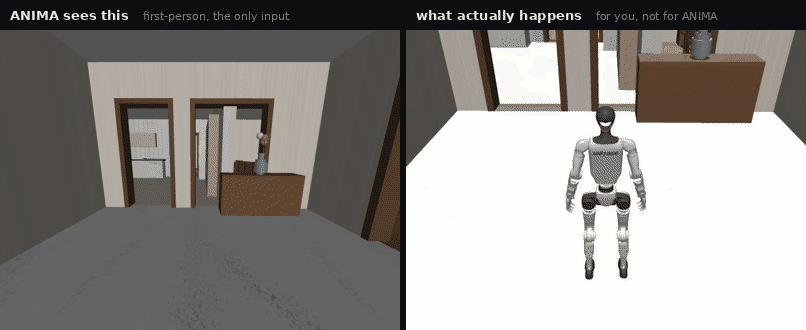
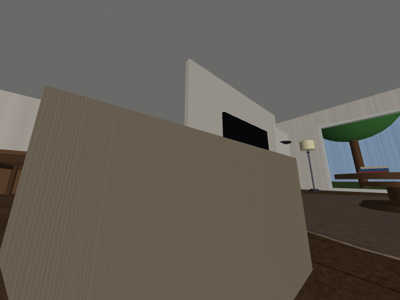
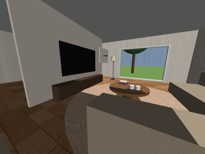
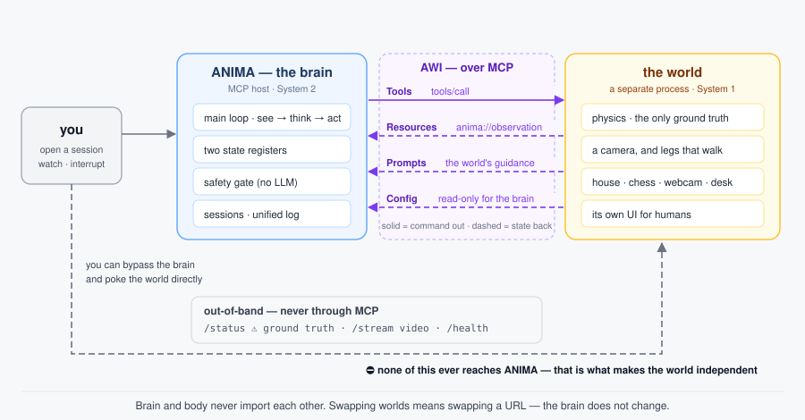
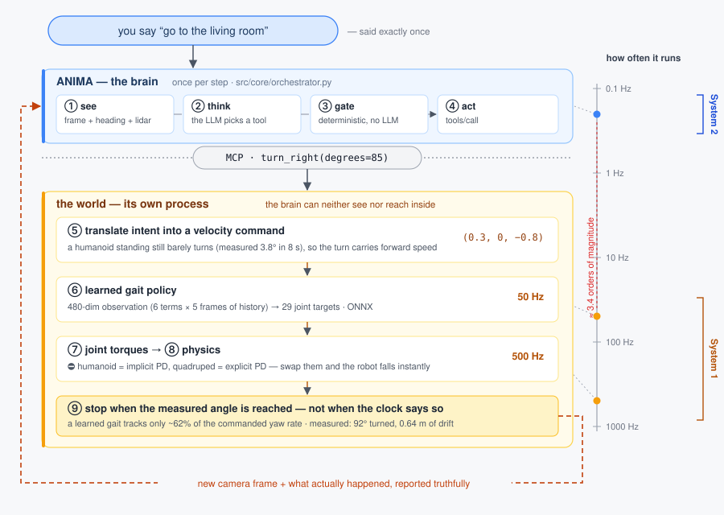
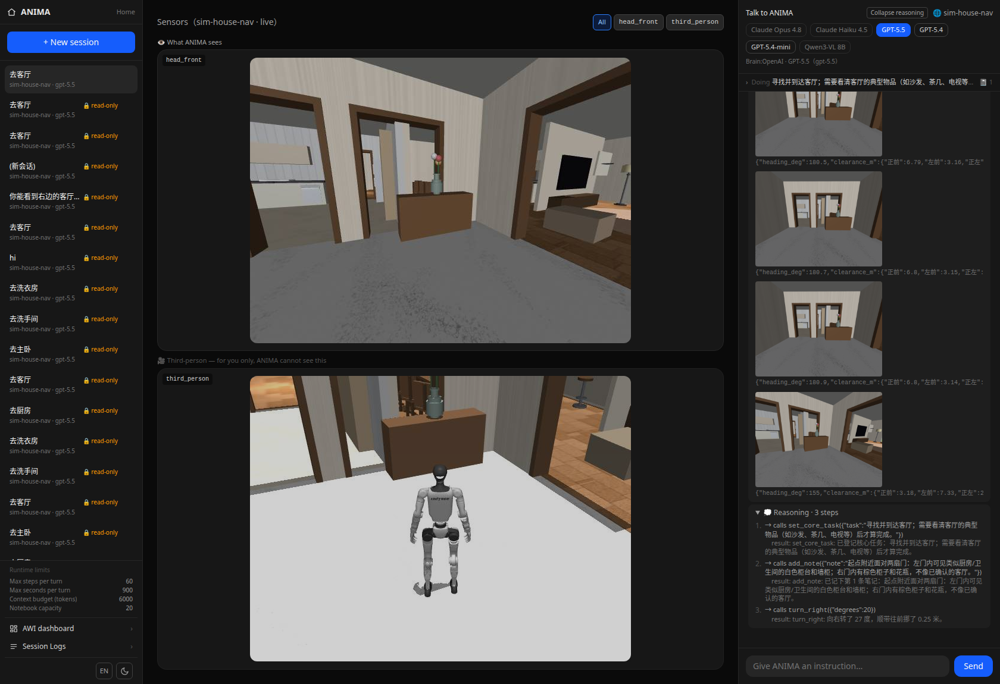

# ANIMA Zero

[](https://www.python.org)
[](https://modelcontextprotocol.io)
[](https://mujoco.org)
[](CHANGELOG.md)
[](../../../LICENSE)

<a href="../../../README.md"></a>
<a href="../zh/README.md"></a>
<a href="../ja/README.md"></a>
<a href="README.md"></a>
<a href="../es/README.md"></a>

> 🤖 **Si vous êtes un agent IA, lisez d'abord [AGENTS.md](../../../AGENTS.md)** — le point d'entrée
> destiné aux machines : la règle de découpage en couches, où vit chaque information, et les commandes.

## Vue d'ensemble

ANIMA Zero est le cerveau d'un robot incarné. Il pense mais ne bouge jamais : il décide *quoi
faire*, et le corps décide *comment bouger*.

Dites-lui « va au salon ». Il n'a ni carte, ni coordonnées, ni liste de pièces — seulement la
caméra posée sur la tête du robot. À partir de là il déduit où il se trouve, choisit une
direction, et continue de marcher jusqu'à voir la pièce demandée. Le robot marche avec une
démarche apprise : les pattes se posent vraiment, rien ne se téléporte.

<div align="center">

<br>

<br>
<sub>Un seul cerveau, deux corps : un humanoïde G1 en haut, un quadrupède Go2 en bas.
Dans chaque séquence, la moitié gauche est la seule entrée qu'ANIMA reçoit ; la moitié droite est
ce qui se passe réellement, et qu'il ne voit jamais.</sub>
</div>

### Pourquoi « Zero » ?

C'est un nom de série, pas un numéro de version. **Zero signifie que cette lignée reste
ouverte** — le cerveau est ANIMA Zero, le corps est SOMA Zero, et toute édition commerciale
future portera un autre nom plutôt que de refermer celle-ci. L'ensemble du projet est sous MIT.

Sur PyPI, c'est `pip install anima-zero` et l'import est `import anima` — `anima` tout court
était déjà enregistré par quelqu'un d'autre.

## Ce qu'il sait faire

- **Un cerveau, des corps différents** : le même code de cerveau pilote un quadrupède Unitree
  Go2 et un humanoïde Unitree G1 sans qu'une ligne change — seule la hauteur des yeux diffère,
  0,38 m contre 1,25 m.
- **Une interface pour n'importe quel monde** : un monde est un processus distinct qui parle AWI
  par-dessus MCP. Changer de monde revient à changer d'URL — et un monde n'est pas digne de
  confiance tant que vous ne l'avez pas relu et approuvé.
- **D'une phrase aux couples articulaires** : une instruction traverse cinq couches avant de
  devenir un mouvement de patte, et ces couches travaillent à trois ordres de grandeur et demi
  d'écart en fréquence.
- **Il se souvient de ce qu'il fait** : deux registres d'état voyagent dans le prompt système,
  si bien qu'un tour de soixante pas n'oublie ni l'objectif ni ce qu'il a déjà écarté.
- **Auditable et interruptible** : chaque image, chaque pensée et chaque appel d'outil sont
  consignés, et un tour en cours peut être arrêté en plein vol.

<div align="center">


<br>
<sub>Le même salon vu par les yeux du quadrupède (à gauche) et par ceux de l'humanoïde (à droite).
Ce qu'un robot peut voir décide de ce qu'il peut conclure, et c'est pourquoi la scène est
construite de façon réaliste plutôt que taillée pour une machine en particulier.</sub>
</div>

## Architecture

Un monde est un programme à part entière — aujourd'hui un simulateur, demain du matériel réel.
ANIMA n'y met jamais la main. Tout ce que le cerveau sait arrive par quatre canaux, et tout ce
qu'il fait repart par les mêmes quatre. Un humain peut aussi contourner complètement le cerveau
et manipuler le monde depuis sa propre interface, ce qui est la preuve la plus nette que les deux
sont réellement séparés.

<div align="center">

</div>

Les trois points d'accès du bas — vérité terrain, vidéo et supervision de vie — ne passent jamais
par MCP et n'atteignent jamais le cerveau. Cette séparation est volontaire : dès l'instant où la
vérité terrain entre dans la perception, la capacité que ce monde est censé éprouver est offerte.

À l'intérieur d'une seule instruction, la stratification devient concrète. Le cerveau raisonne
une fois par pas ; la politique de démarche tourne à 50 Hz ; la physique à 500 Hz. Cet écart est
ce que System 2 et System 1 veulent dire ici, et c'est pourquoi le cerveau ne peut jamais émettre
qu'une intention, jamais des angles articulaires.

<div align="center">

</div>

Le monde rend compte avec honnêteté plutôt qu'avec complaisance. Une démarche apprise ne suit pas
exactement une consigne de vitesse — un virage dérive, une marche reste courte — alors le monde
mesure ce qui s'est réellement passé et le dit, et le cerveau corrige son propre sens de la
position à partir de là, et non de ce qu'il avait demandé.

```text
src/core/      orchestrateur, contrat AWI, magasin de confiance, portail de sécurité
src/clients/   couche client MCP et registre des mondes
src/session/   sessions, fenêtre de contexte, journal unifié
src/llm/       adaptateurs de modèles   src/presentation/  backend HTTP
world/         les mondes, chacun dans son processus
services/      moteur de jeux de plateau   frontend/  appli web   eval/  notation
```

## Installation

```bash
uv tool install anima-zero     # ou : pipx install anima-zero, ou pip tout simplement
```

Cela installe le cerveau, et rien que lui. Un monde est un programme séparé et **aucun n'est
livré dans le wheel** : l'étape suivante est donc d'en obtenir un. Clonez ce dépôt pour ceux
qui vivent dans [`world/`](../../../world/), ou écrivez le vôtre en suivant
[la spécification AWI](../../awi-spec-v1.md).

Le plus rapide pour vous y retrouver est de confier le dépôt à un agent de code — Claude Code,
Codex, celui que vous utilisez — et de le laisser lire [AGENTS.md](../../../AGENTS.md), qui est
écrit exactement pour cela. Il démarrera un monde avec vous, ou vous en écrira un nouveau.

```text
anima chat --world W          une conversation dans le terminal
anima run --say "..."         un seul tour, scriptable
anima serve                   l'API du backend, pour l'appli web
anima world add NOM URL       enregistrer un monde — et le relire avant d'approuver
anima doctor                  ce qui est configuré et ce qui répond
```

### L'installation complète

Trois processus : un monde, le backend et l'appli web. Les scènes et les robots viennent
d'alice-house, cherché à côté de ce dépôt ; définissez `HOUSENAV_ASSETS_ROOT` s'il est ailleurs.

```bash
cd world/sim-house-nav && pip install -e . && uvicorn server:app --port 8112
pip install -e . && cp .env.example .env      # ajoutez une clé d'API, ou visez un Ollama local
anima serve
cd frontend && npm install && npm run dev
```

### Connecter un monde est une décision de confiance

Un monde est un processus distant, et la description qu'il fait de lui-même atterrit dans le
prompt système du cerveau — aussi ses outils et sa `guidance` n'atteignent-ils pas le cerveau
avant que vous ayez regardé et dit oui. `anima world add NOM URL` affiche ce qu'il déclare, puis
demande. L'approbation porte sur le contenu, pas sur le nom : si le monde revient différent, on
vous redemande, avec une note sur ce qui a changé. Pendant que vous développez votre propre
monde, définissez `ANIMA_TRUST_ALL=1`. [SECURITY.md](SECURITY.md) dit contre quoi cela protège,
et contre quoi cela ne protège pas.

## Le voir tourner

Ouvrez l'appli web, créez une session sur `sim-house-nav`, et tapez « va au salon ». La colonne
du milieu montre ce que le robot voit et, séparément, une caméra de poursuite que vous seul
pouvez voir. La colonne de droite montre chaque pas : image, raisonnement, appel d'outil et
réponse du monde.

<div align="center">

</div>

Pour vérifier qu'une affirmation est vraie plutôt que plausible, demandez directement au monde —
`curl -s localhost:8112/status`, un point d'accès de vérification humaine qui n'entre jamais dans
la perception. Changer les pièces coûte une ligne chacune : le corps a un menu déroulant sur le
tableau de bord AWI (ou définissez `HOUSENAV_ROBOT=g1` avant de démarrer le monde), le cerveau en
a un dans l'appli web, et le monde se choisit à la création de la session.

Ces mondes sont livrés avec le dépôt :

| Monde | Port | Ce que c'est |
|---|---|---|
| [sim-house-nav](../../../world/sim-house-nav) | 8112 | Un appartement et un robot qui marche, quadrupède ou humanoïde |
| [sim-chess](../../../world/sim-chess) | 8102 | Un jeu d'échecs qui détient la seule vérité et vous répond |
| [camera](../../../world/camera) | 8104 | Une vraie webcam, sans le moindre outil — regarder sans toucher |

### Ce que cela donne vraiment

Cinq pièces cibles, une tentative chacune, chaque image finale confrontée à la main à ce que le
modèle affirmait :

| Cible | Pas | Résultat |
|---|---|---|
| Cuisine | 9 | Juste — réfrigérateur, plan de travail et placards hauts tous dans le cadre |
| Salon | 5 | Juste — télévision, canapé et lampadaire, pas discutable |
| Chambre principale | 34 | Faux — un sol en marbre lu comme un « matelas blanc » |
| Salle de bain | 40 | Faux — c'était la cuisine |
| Buanderie | 60 | Inachevé — plafond de pas atteint pour ce tour |

Le résultat intéressant est le négatif. La cause soupçonnée était qu'une cuisine et une salle de
bain se ressemblent depuis 0,38 m, ce qui explique en partie l'ajout de l'humanoïde. Mais
l'humanoïde, à 1,25 m, voit nettement la plaque et la hotte et parle quand même d'une salle de
bain. Ce n'est donc pas un problème de perception : face à la même embrasure, le modèle compose
l'histoire qui correspond à la pièce qu'il cherche. La prochaine version vise le critère
d'acceptation à la place.

Les tentatives qui ont fonctionné, avec vérification image par image, sont consignées dans
[world/sim-house-nav/实测记录.md](../../../world/sim-house-nav/实测记录.md).

## Ajouter votre propre monde

Implémentez un serveur MCP standard avec les quatre canaux ci-dessus, ajoutez son adresse à
`ANIMA_WORLDS`, et le cerveau le pilotera sans changer. La version minimale tient en trois
méthodes — `capabilities()`, `observe()` et `invoke()` — enveloppées dans l'adaptateur
`awi_mcp.py` livré avec chaque monde. Recopiez [camera](../../../world/camera) si votre monde
se contente d'être regardé, [sim-chess](../../../world/sim-chess) s'il agit, ou
[sim-house-nav](../../../world/sim-house-nav) pour le cas complet, et lisez d'abord
[world/README.md](../../../world/README.md). Le contrat est écrit dans
[docs/awi-spec-v1.md](../../awi-spec-v1.md), et `anima conformance <url>` confronte un monde à ce
contrat.

## Remerciements

Les scènes, les modèles de robots et les politiques de locomotion viennent d'
[alice-house](https://github.com/jeffliulab/alice-house). La politique de virage de l'humanoïde a
été entraînée dans [unitree-g1-locomotion](https://github.com/jeffliulab/unitree-g1-locomotion).
La physique est [MuJoCo](https://mujoco.org) ; les modèles de robots viennent à l'origine de
[MuJoCo Menagerie](https://github.com/google-deepmind/mujoco_menagerie).
